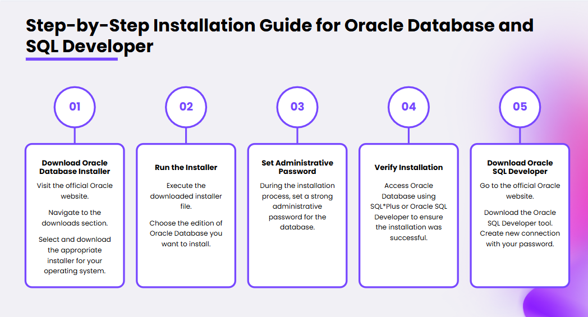
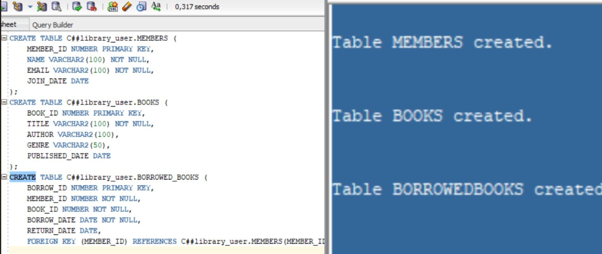
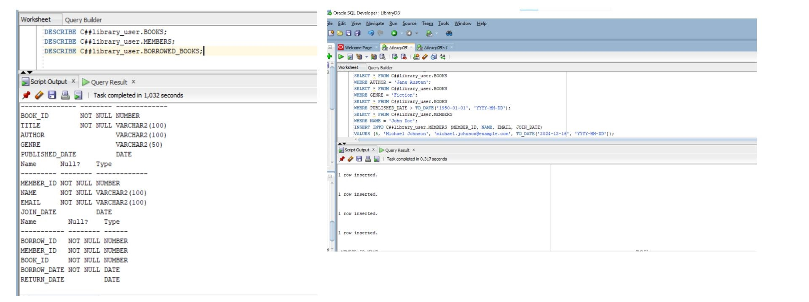
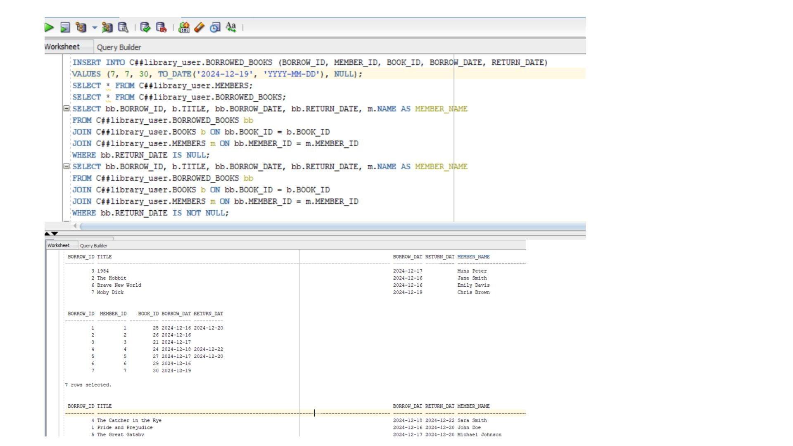
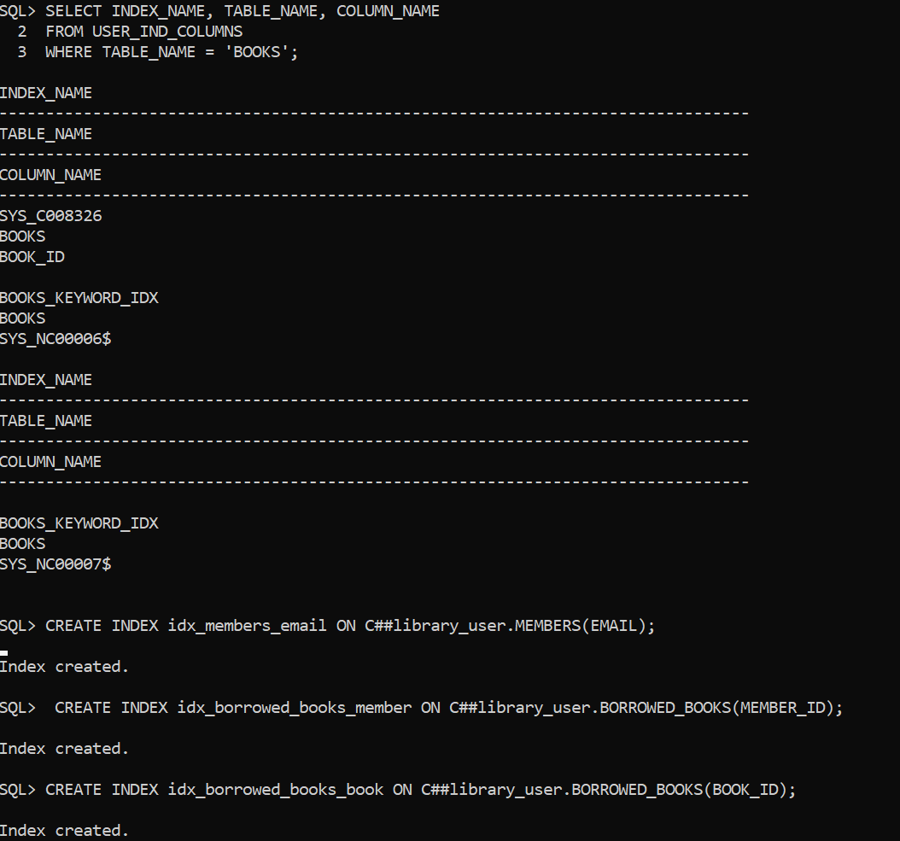
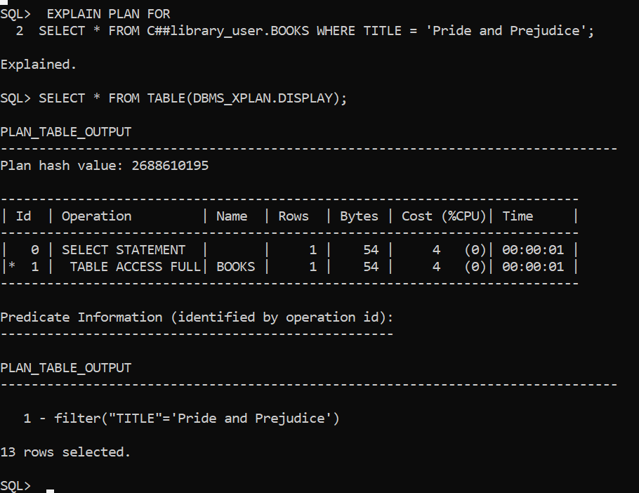
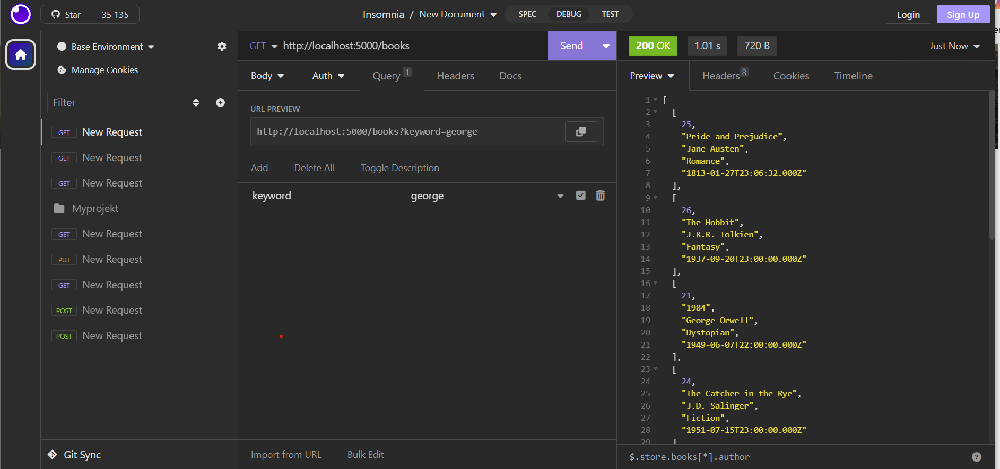
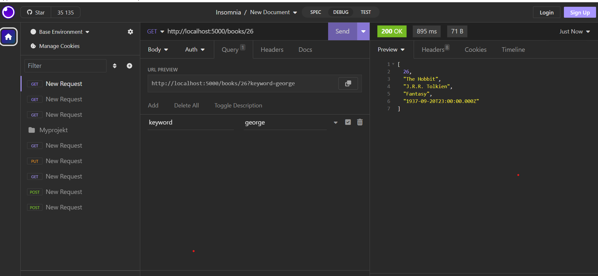

# Bibliotekshanteringssystem vid Oracle Database

## 1. Introduktion

Den här projekt syftar att utforska Oracle Databases funktioner och prestandaoptimering genom att skapa ett enkelt bibliotekssystem. Projekt målet är att få en förståelse för Oracle Database och dess kapacitet.

### Oracle Database:

- Ett objektrelaterat databashanteringssystem (RDBMS) utvecklat av Oracle Corporation.
- Designat för att lagra, hantera och hämta data effektivt.
- Vanligt använt i företag för att hantera stora datamängder och stödja olika applikationer.

### Huvudfunktioner:

- **SQL**: Använder Structured Query Language för datamanipulation och frågehantering.
- **Transaktioner**: Säkerställer dataintegritet och konsistens.
- **Hög Tillgänglighet**: Funktioner för säkerhetskopiering och återställning.
- **Säkerhet**: Erbjuder robusta säkerhetsfunktioner.

## 2. Likheter och Skillnader mellan SQL-databaser och Oracle Database

#### Likheter

**Relationsdatabasmodell**: Både SQL-databaser (som MySQL, PostgreSQL, SQL Server) och Oracle Database använder en relationsdatabasmodell där data lagras i tabeller med rader och kolumner.

**Användning av SQL**: Båda systemen använder Structured Query Language (SQL) som primärt språk för att skapa, läsa, uppdatera och radera data (CRUD-operationer).

**Dataintegritet och ACID-egenskaper**: Båda stöder ACID-egenskaper (Atomicity, Consistency, Isolation, Durability) för att säkerställa att transaktioner är säkra och konsistenta.

**Indexering**: Både SQL-databaser och Oracle Database erbjuder indexeringsfunktioner för att förbättra prestandan vid datahämtning.

**Backup och Återställning**: De har mekanismer för att säkerhetskopiera data och återställa databaser vid fel.

**Stöd för relationer mellan tabeller**: Båda systemen använder primärnycklar, främmande nycklar och relationer för att hantera kopplingar mellan tabeller.

#### Skillnader

**Tillverkare och Licensiering**:
- SQL-databaser: Många SQL-baserade databaser är open source, som MySQL och PostgreSQL, medan andra, som Microsoft SQL Server, är kommersiella.
- Oracle Database: Är kommersiellt och utvecklat av Oracle Corporation. Användning kräver licensavgifter.

**Funktionalitet och Skalbarhet**:
- SQL-databaser: Kan hantera små till medelstora applikationer effektivt. Begränsningar kan uppstå vid extremt stora datamängder eller komplexa operationer.
- Oracle Database: Designad för stora företag och kan hantera massiva datamängder och hög transaktionsvolym. Den har avancerade funktioner för partitionering, replikering och hög tillgänglighet.

**Avancerade Funktioner**:
- SQL-databaser: Stödjer grundläggande funktioner som transaktioner, indexering och säkerhet.
- Oracle Database: Har unika funktioner som Oracle Real Application Clusters (RAC), stöd för funktionsbaserade index, och inbyggt stöd för PL/SQL (Procedural SQL).

**Plattformar och Miljöer**:
- SQL-databaser: Kan köras på olika plattformar, och vissa (som MySQL) är särskilt lätta att sätta upp och använda för webbaserade applikationer.
- Oracle Database: Är mer krävande och vanligtvis konfigurerat i komplexa företagsmiljöer med dedikerade servrar.

**Säkerhet och Kontroll**:
- SQL-databaser: Erbjuder grundläggande säkerhet som rollhantering och autentisering.
- Oracle Database: Har robust säkerhet med funktioner som Virtual Private Database (VPD) och Transparent Data Encryption (TDE).

**Prestandaoptimering**:
- SQL-databaser: Har grundläggande verktyg för optimering som index och frågeanalys.
- Oracle Database: Erbjuder avancerade optimeringsverktyg, inklusive automatisk frågeoptimering och möjligheten att lagra exekveringsplaner.

**Pris**:
- SQL-databaser: Open source-alternativ är ofta gratis, medan kommersiella alternativ som SQL Server har varierande pris.
- Oracle Database: Har högre kostnad på grund av sina avancerade funktioner och företagsfokus.

## 3.Indexering i Oracle Database

Indexering förbättrar prestandan för frågeoperationer genom att minska mängden data som behöver skannas. Oracle stöder flera typer av index:

1. **B-tree Index**:
    - Standard indextyp.
    - Effektiv för exakta matchningar och intervallfrågor.
    - Använder en balanserad trädstruktur.

2. **Bitmap Index**:
    - Perfekt för kolumner med få unika värden.
    - Lagrar rad-ID:n som bitkartor.

3. **Funktionsbaserade Index**:
    - Indexerar uttryck eller funktioner på kolumner.
    - Användbart för frågor som UPPER(column_name).

4. **Partitionerade Index**:
    - Optimerar prestanda för stora tabeller genom att dela upp data i partitioner.

## 4. Installation av Oracle och SQL Developer:
  För att installera Oracle Database och SQL Developer, följ dessa länkar:

- [Ladda ner Oracle Database](https://www.oracle.com/database/technologies/oracle-database-software-downloads.html)
- [Ladda ner SQL Developer](https://www.oracle.com/database/sqldeveloper/technologies/download/)

## 5. Skapandet av databastabeller

- **Böcker (BOOKS)**: Lagrar information om böcker, inklusive titel, författare och publiceringsdatum.
- **Medlemmar (MEMBERS)**: Hanterar information om medlemmar, såsom namn och e-post.
- **Lånade Böcker (BORROWED_BOOKS)**: Spårar lån och returdatum, länkat till tabellerna BOOKS och MEMBERS.

## 6. Datahantering och SQL-frågor

Kontrollera tabellernas struktur med DESCRIBE och lägg till data med INSERT.

Utför olika SQL-frågor för att hämta och verifiera data, till exempel visa lånade böcker.

## 7. Index och Optimering

Förbättra prestandan genom att skapa och kontrollera index på viktiga kolumner, samt optimera SQL-frågor.

- **Index på titlar i böcker**:
- **Index på medlemmars e-post**:
- **Index på lånade böcker**:

Vi använde EXPLAIN PLAN för att analysera och justera frågeoptimering.

## 8. Backend och Frontend Utveckling

Skapa en serverapplikation med Node.js och Express.js för att hantera CRUD-operationer. Framtida förbättringar kan inkludera fler funktioner för medlemmar, förbättrad klient sida med React och rapporteringsverktyg för att analysera lånehistorik.

## 9. Resultat och Framtid

Projektet gav mig en stark grundläggande förståelse för Oracle Database och dess funktioner. Backenden är  nästan klart vid fullt fungerande databas och kan utökas med fler funktioner. Jag har lagt grunden för ett komplett bibliotekssystem som kan vidareutvecklas med rapportering, avancerad sökning och  kommer skapas frontenden för bättre användarupplevelse.

## 10. Sammanfattning

I detta projekt implementerades tekniker för datahantering och optimering i Oracle Database. Genom att skapa B-tree-index på boktitlar och medlemmarnas e-post förbättrades sökprestandan, samtidigt som index användes sparsamt för att undvika att påverka insättnings- och uppdateringsoperationer negativt. EXPLAIN PLAN användes för att analysera och optimera SQL-frågor, vilket resulterade i minskad resursanvändning och snabbare exekvering. Även om transaktionshantering inte implementerades fullt ut, planerades användning av ACID-egenskaper för att säkerställa dataintegritet och konsistens i framtida utveckling. Projektet lade en stabil grund för ett skalbart och effektivt bibliotekssystem.
